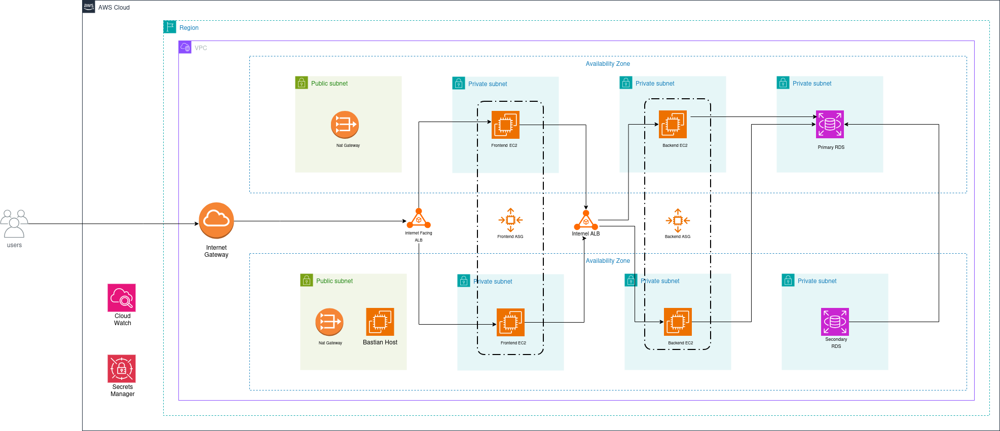

# 3-Tier AWS Architecture

Highly available 3-tier architecture with Terraform

## Architecture Diagram




## AWS Services Used

```hcl
VPC
Public/Private Subnets
Nat Gateway
Internet Gateway
Security Groups
Route Tables
Ec2 Instances
RDS
Secrets
IAM Roles
Auto Scaling Group
Elastic Load Balancer
S3
```
## Architecture
- Terraform Moduler Approach for reusibility
- VPC with 8 subnets in 2 AZ's (2 public, 6 private)
- EC2 instances for Frontend & Backend in each AZ in private subnets
- RDS (Postgres) for storing and retieving user data
- Bastian Host for SSH to private resources
- IG for internet access
- Nat Gateway for internet access from private subnets
- 2 ALB's, 1 internet facing and 1 for internel use
- 2 ASG's, 1 for frontend and 1 for backend
- Secrets for managing RDS credentials
- IAM Roles for access b/w resources
- SG's to control traffic
- S3 for storing terraform state
- User_data scrips for downloading docker images


## Steps to Run

**Create keys for EC2 instances**
```bash
ssh-keygen -t ed25519 -C "key-name"  

### Enter Key Location
### Enter PassPhrase
```
**Create Docker Images**  
```bash
docker login  

#Build Docker Images for Frontend & Backend
docker build -t "user_name/image_name:tag" .  

# Push both docker Images 
docker push "user_name/iamge_name:tag"
```
**Enter Variable Values** 
- Add Images names to Environments/Dev/variables.tf
- Add Key name to Environments/Dev/variables.tf
- Enter your Ip in allowed ssh IP's 
- Modify other variable values if needed 

**Configure AWS CLI**
```bash
# Login to AWS account
aws configure

### Enter Access key
### Enter Secret Key

```


**Run Terraform**
```bash
# Initialize Terraform
terraform init

# Validate to check if there is any issue
terraform validate

# Plan to check which resources will be created
terraform plan

# Create Resources on AWS
terrafrom apply

# Cleanup and Destroy all resources on AWS
terraform destroy
```

**Debugging**
```bash
- SSH to Bastian Host
  ssh -i "<key_name>" ubuntu@"<bastian_public_ip>" 

- SSH to Frontend/Backend
  # Copy key from local to bastian host
  scp -i "<key_name>" "<key_name>" ubuntu@"<bastian_public_ip>":~/
  #ssh to frontend/backend instance from bastian host
  ssh -i "<key_name>" ubuntu@"<private_ip>"

- Check Docker Logs
  # List all containers
  docker ps
  # Check logs for container
  docker logs "<container_id>"

- Check user_data logs
  # print user_data logs 
  cat /var/log/cloud-init-output.log
```


**Credits**
```hcl
This project is inspired from Piyush Sachdeva Terraform Repo. Original repo can fount at "https://github.com/piyushsachdeva/Terraform-Full-Course-Aws/tree/main/lessons/day28/terraform-infra".

user_data scripts for frontend/backend/bastian_host and docker files can be downloaded from original repo.
```
